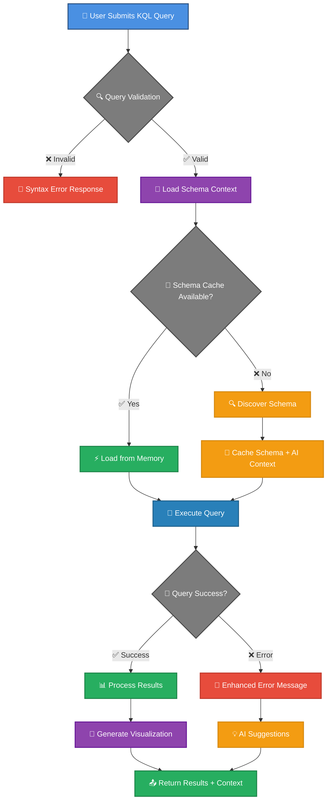
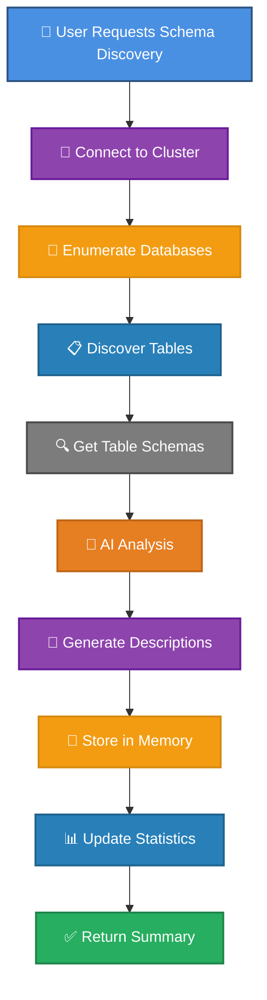

# MCP KQL Server

mcp-name: io.github.4R9UN/mcp-kql-server

[](https://mseep.ai/app/4r9un-mcp-kql-server)

> **AI-Powered KQL Query Execution with Natural Language to KQL (NL2KQL) Conversion and Execution**

A Model Context Protocol (MCP) server that transforms natural language questions into optimized KQL queries with intelligent schema discovery, AI-powered caching, and seamless Azure Data Explorer integration. Simply ask questions in plain English and get instant, accurate KQL queries with context-aware results.

**Latest Version: v2.1.2** - Hardcoded 10-minute Kusto `servertimeout`, ADX-side dry-run validation for generated queries, schema-drift recovery loop, and fully schema-driven NL2KQL with no hardcoded table or column names.

<!-- Badges Section -->

[](https://mseep.ai/app/18772353-3d90-4b12-a253-cf752efaadd2)
[](https://registry.modelcontextprotocol.io/v0/servers?search=io.github.4R9UN/mcp-kql-server)
[](https://pypi.org/project/mcp-kql-server/)
[](https://pypi.org/project/mcp-kql-server/)

[](https://github.com/4R9UN/mcp-kql-server/actions)
[](https://codecov.io/gh/4R9UN/mcp-kql-server)
[](https://github.com/4R9UN/mcp-kql-server/security)
[](https://github.com/4R9UN/mcp-kql-server)

[](https://github.com/jlowin/fastmcp)
[](https://azure.microsoft.com/en-us/services/data-explorer/)
[](https://github.com/anthropics/mcp)
[](https://github.com/4R9UN/mcp-kql-server/graphs/commit-activity)
[](https://lobehub.com/mcp/4r9un-mcp-kql-server)


## 🎬 Demo

Watch a quick demo of the MCP KQL Server in action:

[](https://www.youtube.com/watch?v=Ca-yuThJ3Vc)

## 🆕 What's New in v2.1.2

- **⏱️ Hardcoded 10-min Query Timeout**: Every Kusto call now ships `ClientRequestProperties.servertimeout` (capped at 600s). Long queries no longer silently die at the ADX default of ~4 minutes.
- **🔍 ADX-Side Dry-Run Validation**: NL2KQL leader candidates are wrapped as `<query> | take 0` and bound by ADX itself. Catches schema drift the cached validator misses, costs zero rows.
- **🔁 Schema-Drift Recovery Loop**: On `SEM0100` / "failed to resolve" failures the server refreshes the schema, repairs the query against real columns, and retries exactly once. No infinite loops.
- **🧭 Smarter Retry Policy**: Server-side timeouts are no longer auto-retried (was burning 3× the budget). Only true transport failures (refused, reset, throttled, DNS, socket) retry.
- **🪪 Per-Request Trace IDs**: Each Kusto call carries a unique `client_request_id` for cross-process correlation.
- **🧹 Schema-Driven Generation**: Removed all hardcoded table, cluster, and column names from the NL2KQL pipeline. Time columns and join keys are derived from the live schema.
- **🧰 Cleanup**: Removed legacy manual verification scripts; added pinned regression tests for timeout, error classifier, and dry-run.

## 🆕 What's New in v2.1.1

- **🎯 Schema-First CAG**: KQL generation now ranks tables and columns from cached schema context before building queries.
- **🧠 Strict Table Context**: `schema_memory(operation="get_context")` can be scoped to a specific table and returns allowed/recommended columns.
- **🩹 Schema-Grounded Repair**: Invalid client-generated KQL can be repaired against real schema columns before execution.
- **💾 Safer Cache Isolation**: Query-result cache is scoped by query, cluster, database, and output namespace.
- **♻️ No Redundant Reindexing**: Existing cached schemas are reused and no longer overwritten by placeholder discovery paths.

See [RELEASE_NOTES.md](RELEASE_NOTES.md) for full details.

## 🚀 Features

- **`execute_kql_query`**:
    - **Natural Language to KQL**: Generate KQL queries from natural language descriptions.
    - **Direct KQL Execution**: Execute raw KQL queries.
    - **Multiple Output Formats**: Supports JSON, CSV, and table formats.
    - **Strict Schema Validation**: Uses discovered schema memory and validation before execution.
    - **Schema-Grounded Repair**: Repairs invalid columns only when a valid table schema can prove the replacement.

- **`schema_memory`**:
    - **Schema Discovery**: Discover and cache schemas for tables.
    - **Database Exploration**: List all tables within a database.
    - **AI Context**: Get ranked CAG context for tables, with optional table-scoped strict schema output.
    - **Analysis Reports**: Generate reports with visualizations.
    - **Cache Management**: Clear or refresh the schema cache.
    - **Memory Statistics**: Get statistics about the memory usage.


## 📊 MCP Tools Execution Flow



### Schema Memory Discovery Flow

The schema memory flow is integrated into query execution, but it now reuses existing cached schema before attempting live discovery. If a table schema is already available in CAG/schema memory, the server will use that cached schema instead of re-indexing it.




## 📋 Prerequisites

- Python 3.10 or higher
- [Azure CLI](https://learn.microsoft.com/en-us/cli/azure/install-azure-cli-windows?view=azure-cli-latest&pivots=msi) installed and authenticated (`az login`)
- Access to Azure Data Explorer cluster(s)

## 🚀 One-Command Installation

### Quick Install (Recommended)

#### From Source

```bash
git clone https://github.com/4R9UN/mcp-kql-server.git && cd mcp-kql-server && pip install -e .
```
### Alternative Installation Methods

```bash
pip install mcp-kql-server
```

**That's it!** The server automatically:
- ✅ Sets up memory directories in `%APPDATA%\KQL_MCP` (Windows) or `~/.local/share/KQL_MCP` (Linux/Mac)
- ✅ Configures optimal defaults for production use
- ✅ Suppresses verbose Azure SDK logs
- ✅ No environment variables required


## 📱 MCP Client Configuration

> **One-time install (any platform):**
> ```bash
> pip install --upgrade mcp-kql-server
> ```
> After install, **prefer the `mcp-kql-server` console script** in your client config. It is dropped on PATH by `pip` and bypasses the "which Python is `python`?" trap that VS Code's Python extension creates by silently substituting a cached interpreter path.

### Claude Desktop

Add to your Claude Desktop MCP settings file (`mcp_settings.json`):

**Location:**
- **Windows**: `%APPDATA%\Claude\mcp_settings.json`
- **macOS**: `~/Library/Application Support/Claude/mcp_settings.json`
- **Linux**: `~/.config/Claude/mcp_settings.json`

```json
{
  "mcpServers": {
    "mcp-kql-server": {
      "type": "stdio",
      "command": "mcp-kql-server",
      "args": []
    }
  }
}
```

<details>
<summary>Alternative: invoke via the Python module (Windows uses the <code>py</code> launcher)</summary>

```json
{
  "mcpServers": {
    "mcp-kql-server": {
      "type": "stdio",
      "command": "py",
      "args": ["-3", "-m", "mcp_kql_server"]
    }
  }
}
```
On macOS / Linux replace `"py"` with `"python3"`.
</details>

### VSCode (with MCP Extension)

Add to your VSCode MCP configuration:

**Settings.json location:**
- **Windows**: `%APPDATA%\Code\User\mcp.json`
- **macOS**: `~/Library/Application Support/Code/User/mcp.json`
- **Linux**: `~/.config/Code/User/mcp.json`

```json
{
  "servers": {
    "mcp-kql-server": {
      "type": "stdio",
      "command": "mcp-kql-server",
      "args": []
    }
  }
}
```

> **If VS Code logs `spawn ...PythonNNN/python.exe ENOENT`**, the Python extension is substituting a cached interpreter path for `"python"`. Switch to the `"mcp-kql-server"` console script (above) or to `"py"` / `"python3"`. Do **not** use the bare string `"python"` on Windows when VS Code's Python extension is installed.

### Roo-code Or Cline (VS-code Extentions)

Ask or Add to your Roo-code Or Cline MCP settings:

**MCP Settings location:**
- **All platforms**: Through Roo-code extension settings or `mcp_settings.json`

```json
{
  "mcp-kql-server": {
    "type": "stdio",
    "command": "mcp-kql-server",
    "args": [],
    "alwaysAllow": []
  }
}
```

### Generic MCP Client

For any MCP-compatible application:

```bash
# Preferred: console script installed by pip (cross-platform)
mcp-kql-server

# Equivalent module form (Windows uses the py launcher)
py -3 -m mcp_kql_server     # Windows
python3 -m mcp_kql_server   # macOS / Linux

# Server provides these tools:
# - execute_kql_query: Execute KQL or generate KQL from natural language
# - schema_memory: Discover, cache, and inspect cluster schemas
```
## 🔧 Quick Start

### 1. Authenticate with Azure (One-time setup)

```bash
az login
```

### 2. Start the MCP Server (Zero configuration)

```bash
python -m mcp_kql_server
```

The server starts immediately with:
- 📁 **Auto-created memory path**: `%APPDATA%\KQL_MCP\cluster_memory`
- 🔧 **Optimized defaults**: No configuration files needed
- 🔐 **Secure setup**: Uses your existing Azure CLI credentials

### 3. Use via MCP Client

The server provides two main tools:

> #### `execute_kql_query` - Execute KQL queries or generate KQL from natural language
> #### `schema_memory` - Discover, refresh, and inspect cached cluster schemas


## 💡 Usage Examples

### Basic Query Execution

Ask your MCP client (like Claude):
> "Execute this KQL query against the help cluster: `cluster('help.kusto.windows.net').database('Samples').StormEvents | take 10` and summarize the result and give me high level insights "

### Complex Analytics Query

Ask your MCP client:
> "Query the Samples database in the help cluster to show me the top 10 states by storm event count, include visualization"

### Schema Discovery

Ask your MCP client:
> "Discover and cache the schema for the help.kusto.windows.net cluster, then tell me what databases and tables are available"

### Data Exploration with Context

Ask your MCP client:
> "Using the StormEvents table in the Samples database on help cluster, show me all tornado events from 2007 with damage estimates over $1M"

### Time-based Analysis

Ask your MCP client:
> "Analyze storm events by month for the year 2007 in the StormEvents table, group by event type and show as a visualization"


## 🎯 Key Benefits

### For Data Analysts
- **⚡ Faster Query Development**: AI-powered autocomplete and suggestions
- **🎨 Rich Visualizations**: Instant markdown tables for data exploration
- **🧠 Context Awareness**: Understand your data structure without documentation

### For DevOps Teams
- **🔄 Automated Schema Discovery**: Keep schema information up-to-date
- **💾 Smart Caching**: Reduce API calls and improve performance
- **🔐 Secure Authentication**: Leverage existing Azure CLI credentials

### For AI Applications
- **🤖 Intelligent Query Assistance**: AI-generated table descriptions and suggestions
- **📊 Structured Data Access**: Clean, typed responses for downstream processing
- **🎯 Context-Aware Responses**: Rich metadata for better AI decision making

## 🏗️ Architecture

```mermaid
%%{init: {'theme':'dark', 'themeVariables': {
  'primaryColor':'#1a1a2e',
  'primaryTextColor':'#00d9ff',
  'primaryBorderColor':'#00d9ff',
  'secondaryColor':'#16213e',
  'secondaryTextColor':'#c77dff',
  'secondaryBorderColor':'#c77dff',
  'tertiaryColor':'#0f3460',
  'tertiaryTextColor':'#ffaa00',
  'tertiaryBorderColor':'#ffaa00',
  'lineColor':'#00d9ff',
  'textColor':'#ffffff',
  'mainBkg':'#0a0e27',
  'nodeBorder':'#00d9ff',
  'clusterBkg':'#16213e',
  'clusterBorder':'#9d4edd',
  'titleColor':'#00ffff',
  'edgeLabelBackground':'#1a1a2e',
  'fontFamily':'Inter, Segoe UI, sans-serif',
  'fontSize':'16px',
  'flowchart':{'nodeSpacing':60, 'rankSpacing':80, 'curve':'basis', 'padding':20}
}}}%%
graph LR
    Client["🖥️ MCP Client<br/><b>Claude / AI / Custom</b><br/>─────────<br/>Natural Language<br/>Interface"]
    
    subgraph Server["🚀 MCP KQL Server"]
        direction TB
        FastMCP["⚡ FastMCP<br/>Framework<br/>─────────<br/>MCP Protocol<br/>Handler"]
        NL2KQL["🧠 NL2KQL<br/>Engine<br/>─────────<br/>AI Query<br/>Generation"]
        Executor["⚙️ Query<br/>Executor<br/>─────────<br/>Validation &<br/>Execution"]
        Memory["💾 Schema<br/>Memory<br/>─────────<br/>AI Cache"]
        
        FastMCP --> NL2KQL
        NL2KQL --> Executor
        Executor --> Memory
        Memory --> Executor
    end
    
    subgraph Azure["☁️ Azure Services"]
        direction TB
        ADX["📊 Azure Data<br/>Explorer<br/>─────────<br/><b>Kusto Cluster</b><br/>KQL Engine"]
        Auth["🔐 Azure<br/>Identity<br/>─────────<br/>Device Code<br/>CLI Auth"]
    end
    
    %% Client to Server
    Client ==>|"📡 MCP Protocol<br/>STDIO/SSE"| FastMCP
    
    %% Server to Azure
    Executor ==>|"🔍 Execute KQL<br/>Query & Analyze"| ADX
    Executor -->|"🔐 Authenticate"| Auth
    Memory -.->|"📥 Fetch Schema<br/>On Demand"| ADX
    
    %% Styling - Using cyberpunk palette
    style Client fill:#1a1a2e,stroke:#00d9ff,stroke-width:4px,color:#00ffff
    style FastMCP fill:#16213e,stroke:#c77dff,stroke-width:3px,color:#c77dff
    style NL2KQL fill:#1a1a40,stroke:#ffaa00,stroke-width:3px,color:#ffaa00
    style Executor fill:#16213e,stroke:#9d4edd,stroke-width:3px,color:#9d4edd
    style Memory fill:#0f3460,stroke:#00d9ff,stroke-width:3px,color:#00d9ff
    style ADX fill:#1a1a2e,stroke:#ff6600,stroke-width:4px,color:#ff6600
    style Auth fill:#16213e,stroke:#00ffff,stroke-width:2px,color:#00ffff
    
    style Server fill:#0a0e27,stroke:#9d4edd,stroke-width:3px,stroke-dasharray: 5 5
    style Azure fill:#0a0e27,stroke:#ff6600,stroke-width:3px,stroke-dasharray: 5 5
```



**Report Generated by MCP-KQL-Server** | [⭐ Star this repo on GitHub](https://github.com/4R9UN/mcp-kql-server)

## 🚀 Production Deployment

Ready to deploy MCP KQL Server to Azure for production use? We provide comprehensive deployment automation for **Azure Container Apps** with enterprise-grade security and scalability.

### 🌟 Features
- ✅ **Serverless Compute**: Azure Container Apps with auto-scaling
- ✅ **Managed Identity**: Passwordless authentication with Azure AD
- ✅ **Infrastructure as Code**: Bicep templates for reproducible deployments
- ✅ **Monitoring**: Integrated Log Analytics and Application Insights
- ✅ **Secure by Default**: Network isolation, RBAC, and least-privilege access
- ✅ **One-Command Deploy**: Automated PowerShell and Bash scripts

### 📖 Deployment Guide

For complete deployment instructions, architecture details, and troubleshooting:

**👉 [View Production Deployment Guide](./deployment/README.md)**

The guide includes:
- 🏗️ Detailed architecture diagrams
- ⚙️ Step-by-step deployment instructions (PowerShell & Bash)
- 🔒 Security configuration best practices
- 🐛 Troubleshooting common issues
- 📦 Docker containerization details

### Quick Deploy

```bash
# PowerShell (Windows)
cd deployment
.\deploy.ps1 -SubscriptionId "YOUR_SUB_ID" -ResourceGroupName "mcp-kql-prod-rg" -ClusterUrl "https://yourcluster.region.kusto.windows.net"

# Bash (Linux/Mac/WSL)
cd deployment
./deploy.sh --subscription "YOUR_SUB_ID" --resource-group "mcp-kql-prod-rg" --cluster-url "https://yourcluster.region.kusto.windows.net"
```

## 📁 Project Structure

```
mcp-kql-server/
├── mcp_kql_server/
│   ├── __init__.py          # Package initialization
│   ├── mcp_server.py        # Main MCP server implementation
│   ├── execute_kql.py       # KQL query execution logic
│   ├── memory.py            # Advanced memory management
│   ├── kql_auth.py          # Azure authentication
│   ├── utils.py             # Utility functions
│   └── constants.py         # Configuration constants
├── docs/                    # Documentation
├── Example/                 # Usage examples
├── pyproject.toml          # Project configuration
└── README.md               # This file
```

## 🔒 Security

- **Azure CLI Authentication**: Leverages your existing Azure device login
- **No Credential Storage**: Server doesn't store authentication tokens
- **Local Memory**: Schema cache stored locally, not transmitted

## 🐛 Troubleshooting

### Common Issues

1. **Authentication Errors**
   ```bash
   # Re-authenticate with Azure CLI
   az login --tenant your-tenant-id
   ```

2. **Memory Issues**
   ```bash
   # The memory cache is now managed automatically. If you suspect issues,
   # you can clear the cache directory, and it will be rebuilt on the next query.
   # Windows:
   rmdir /s /q "%APPDATA%\KQL_MCP\unified_memory.json"
   
   # macOS/Linux:
   rm -rf ~/.local/share/KQL_MCP/cluster_memory
   ```

3. **Connection Timeouts**
   - Check cluster URI format
   - Verify network connectivity
   - Confirm Azure permissions

## 🤝 Contributing

We welcome contributions! Please do. 

## 📞 Support

- **Issues**: [GitHub Issues](https://github.com/4R9UN/mcp-kql-server/issues)
- **PyPI Package**: [PyPI Project Page](https://pypi.org/project/mcp-kql-server/)
- **Author**: [Arjun Trivedi](mailto:arjuntrivedi42@yahoo.com)
- **Certified** : [MCPHub](https://mcphub.com/mcp-servers/4R9UN/mcp-kql-server)

## 🌟 Star History

[](https://star-history.com/#4R9UN/mcp-kql-server&Date)

---
mcp-name: io.github.4R9UN/mcp-kql-server

**Happy Querying! 🎉**
